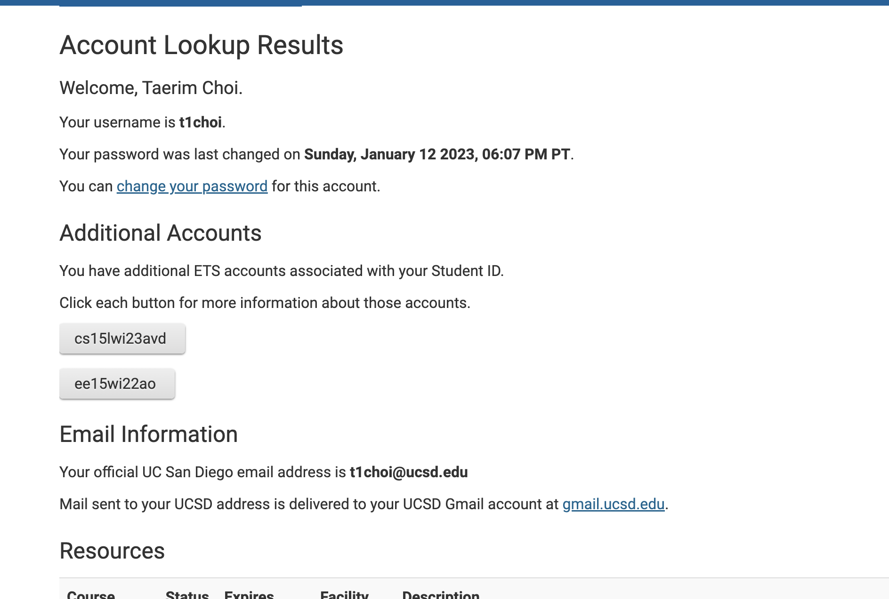
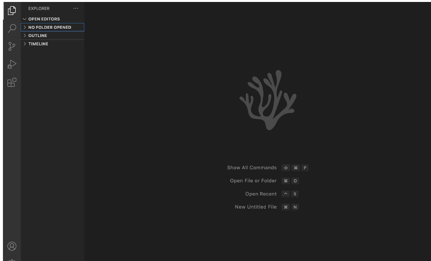
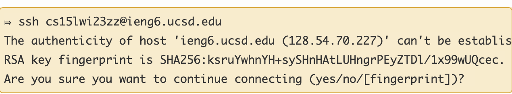
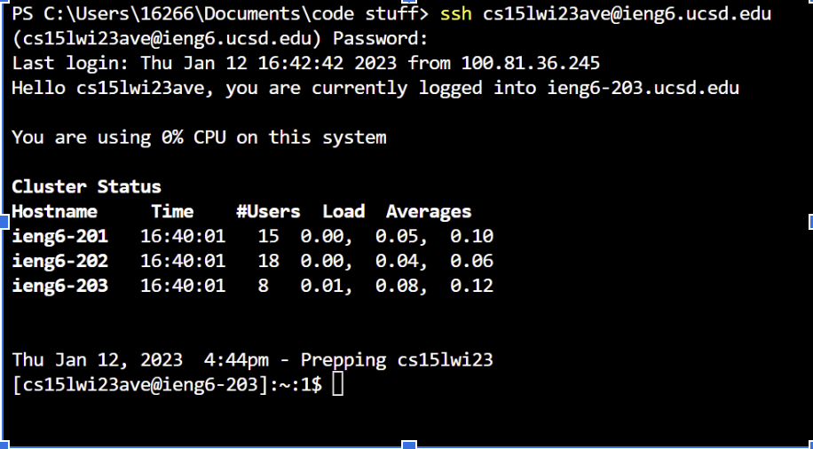

1) Search up your course specific account using https://sdacs.ucsd.edu/~icc/index.php
2) Look up your account using your MyTritonLink login
3) The page should return the following screenshot
   
4) Go to the Visual Studio Code website: https://code.visualstudio.com/ and download it with the appropriate operating system
5) When installed, something similar to the following loading screen will pop up
  
6) Open up a terminal in VSCode and utilize ssh
7) The command line input should be "$ ssh cs15lwi23zz@ieng6.ucsd.edu" with zz replaced by the letters in your course specific account
8) Once the following authentication message occur, click yes and enter your password

9) Once you're logged in, you should see the following specifications
  
10) To ensure the remote server is connected to your computer, try some commands such as cd, ls, etc.
11) You can also log out using Ctrl+D and the "exit" command.
